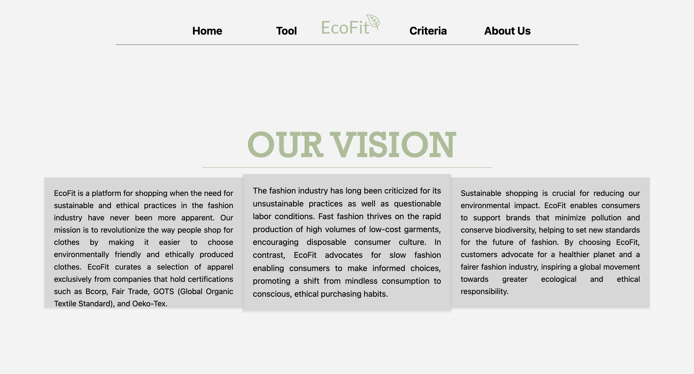
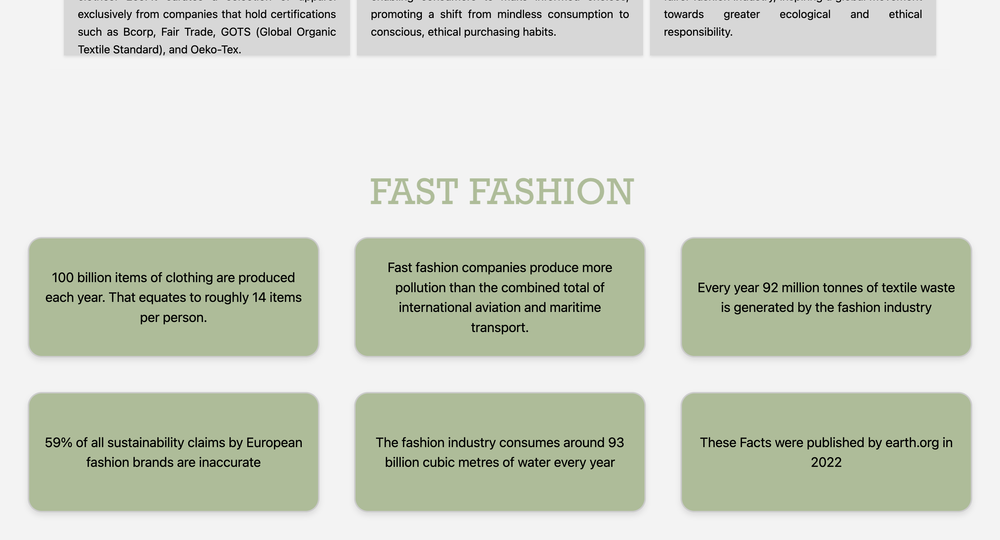
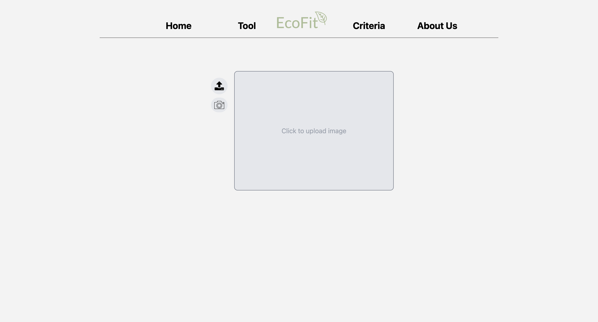
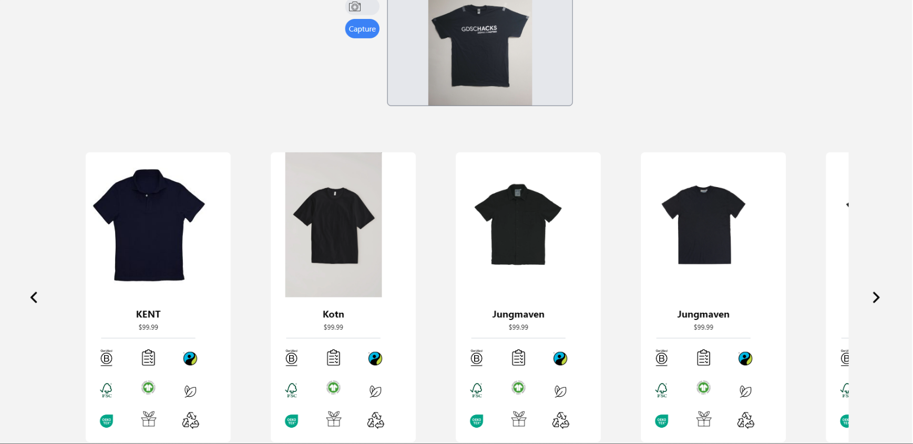
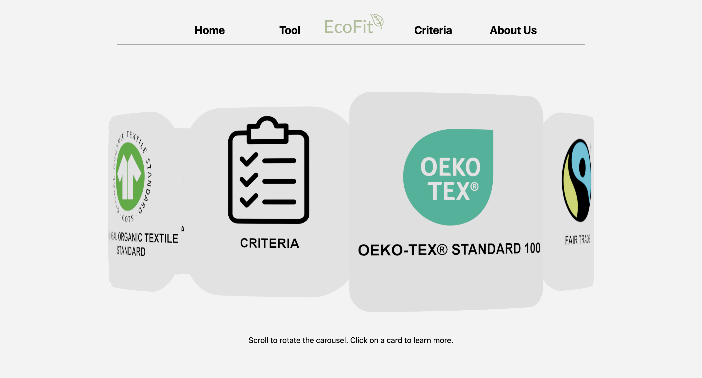
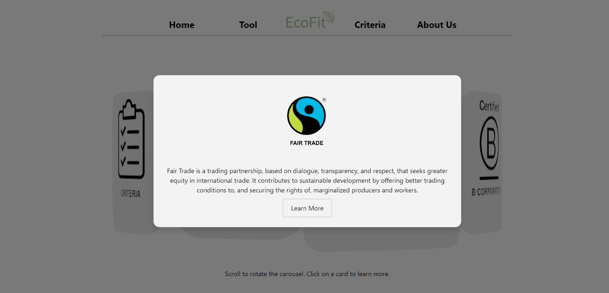

[](images/banner.png)
# EcoFit
`EcoFit` is inspired by the fashion industry’s deep-rooted issues—its environmental toll and unethical labor practices. Founded by Carsten, Dev, Liran, and Tanveer, `EcoFit` was created as a beacon of awareness against the unethical and unsustainable practices rampant in fast fashion giants like Shein, YesStyle, and H&M. The fashion industry's alarming production of 92 million tonnes of textile waste in 2020 underscored the need for a radical change. By emphasizing slow fashion, `EcoFit` aims to shift consumer behavior from mindless consumption to conscious, ethical purchasing. Our platform enables users to enjoy fashion without compromising the health of our planet or the rights of its people. This pivotal shift not only furthers environmental sustainability but also bolsters fair labor practices, driving substantial improvements in global ecological and ethical standards.

<p>
  
</p

[](images/homemenu.png) [](images/homemenu2.png)
[](images/tool.png) [](images/tool2.png)
[](images/badges.png) [](images/badges2.png)


## How to Use

1. Install Required Packages: Open a terminal or command prompt and install the necessary packages using the following command:

   #### Backend
   ```shell
    pip install Pillow
    pip install scikit-learn
    pip install keras
    pip install numpy
    pip install pymongo
    pip install flask
    pip install flask-cors
    pip install python-dotenv
    ```
    #### Frontend
    ```shell
    npm install
    ```
    

2. Open two terminals in project location and run the commands below:
    #### First terminal

    ```shell
    cd EcoFit
    cd backend
    python3 main.py
    ```
    #### Second terminal
    ```shell 
    cd EcoFit
    cd frontend
    npm run dev
    ```
    #### In the second terminal enter 'o' and return to open webpage. To exit enter 'q'.
    #### Return back to the first terminal and enter 'ctrl + c' to end backend processes if you wish to quit.


## Learnings from the Project

- **ThreeJS and Creating 3D elements**: For us, working with Three.js was for the most part. a new venture. While we did have some experience, using threeJS brought a steep learning curve. We tackled the complexities of creating custom geometries and interactive 3D elements for the first time. The implementation of image recognition technology was another area where we faced significant challenges. Learning to effectively match user-uploaded images with our product database involved understanding the nuances of machine learning models geared towards image processing.

- **Using MongoDB**:  All four of us had very little to no experience using MongoDB. We learned how to store data, sort through the data in the database, and to navigate the database to find the most similar sustainable fashion alternatives.

- **React**: We learned how to use React, a popular JavaScript library for building user interfaces. The tools within React allowed us to build a robust and scalable application, and learning them has equipped us with useful skills.

## Future Goals and Ideas

As we look to the future, EcoFit is poised for significant growth and further innovation. Our roadmap is focused on enhancing our platform's capabilities and extending our impact in sustainable fashion. Here are our key objectives:

- **Enhancing Image Recognition Capabilities**: We plan to continue training our machine learning model, improving its accuracy and efficiency. By refining our image recognition technology, we aim to provide even faster and more precise matches between user-uploaded images and sustainable products in our database. This will not only enhance user experience but also ensure that our recommendations are as relevant and helpful as possible.

- **Expanding Certification Criteria**: Another major goal is to expand our list of recognized certifications. Currently, we focus on standards like OEKO-TEX 100 and GOTS, but we intend to include more certifications that reflect a commitment to both environmental and social responsibility. By doing so, we will offer a wider range of options to our users, supporting even more brands that are doing meaningful work towards sustainability.

- **Continuing to Spread Awareness**: Education and awareness are at the heart of EcoFit’s mission. We will keep working to spread awareness about the importance of sustainable and ethical fashion.


## Summary
`EcoFit` empowers users with innovative technology to shop sustainably without the guesswork. Our platform features an image recognition function that allows users to either upload a photo of an apparel item or take a new picture directly through the app. This smart feature then searches our extensive database for similar items exclusively from brands that possess reputable sustainable certifications like OEKO-TEX 100 and GOTS.

Once a match is found, `EcoFit` provides not only a direct link to the product but also a detailed display of all its certifications. This transparency ensures that users are fully informed about the ethical and environmental standards of the products they choose, fostering trust and promoting conscious consumerism. Through this technology, `EcoFit` makes it easier than ever for anyone to make ethical fashion choices that align with their values and lifestyle.
